  

<!-- TODO: add links once known

-->

## 👋 About me

I'm a BS Data Science student at **IIT Madras** who likes taking ML from a notebook to a working system. Most of my time goes into **medical imaging**: at SGBC Brain Centre I integrate and benchmark brain-segmentation tools (SynthSeg, BiomedParse, ANTsPy) and score them with Dice. The rest goes into **hackathons and Kaggle**, where I build vision and agentic systems against tight deadlines.

**Right now**

- 🧠 Benchmarking brain MRI segmentation pipelines at SGBC Brain Centre
- 🗣️ Researching user behavior, credibility and networks on Reddit (research internship, Department of Management Studies (DoMS))
- 🌕 Building Chandrayaan-2 lunar image registration for Smart India Hackathon 2026
- 🏁 Competing on Kaggle and at hackathons, usually with agriculture, health or climate problems

Other things I've built: a travel RAG agent (LangGraph, Qdrant hybrid search, Cohere reranking, FastAPI, Next.js), a whole-slide digital pathology pipeline on PyTorch foundation models, and **AgroSkin**, an AI skin-disease detector.

## 🏆 Results

| Result | Competition and what I built |
|:--|:--|
| 🏆 **Rank 5** | **Kaya AI IIT Hackathon 2026.** FieldPilot AI: hands-free construction-site inspection on smart glasses, a 10-agent system with YOLO, Qwen2.5-VL, Whisper and a Qdrant RAG pipeline, built in a 20-hour sprint |
| 🥇 **Rank 9** | **Kaggle, Agricultural Image Super-Resolution.** 30-block RCAN model |
| 🚀 **Top 10** | **TrackShift Innovation Challenge** |
| ⭐ **Top 40** | **IIT Delhi Innov8 Challenge** |
| 📦 **Top 1,500** | **Amazon ML Challenge** |

## 🧰 Toolkit

<table>
<tr>
<td><b>Languages</b></td>
<td></td>
</tr>
<tr>
<td><b>ML and vision</b></td>
<td></td>
</tr>
<tr>
<td><b>Apps and APIs</b></td>
<td></td>
</tr>
<tr>
<td><b>Tooling</b></td>
<td></td>
</tr>
<tr>
<td><b>GenAI</b></td>
<td>

</td>
</tr>
<tr>
<td><b>Medical imaging</b></td>
<td>

</td>
</tr>
</table>

## 🚀 Latest work

<!-- AUTO:PROJECTS:START -->
<table>
<tr>
<td width="50%" valign="top">
<a href="https://github.com/nitya-prakash-pandey-2005/TyreMind"><b>TyreMind</b></a> AI-powered tyre intelligence that separates true tyre degradation from fuel, traffic, driver, weather, and track effects using physics-informed ML, latent-state estimation, uncertainty modeling, counterfactual simulation, and race strategy optimization.
   updated 2 weeks ago
</td>
<td width="50%" valign="top">
<a href="https://github.com/nitya-prakash-pandey-2005/SAGE"><b>SAGE</b></a> SAGE (Safe Agentic Growth Engine): The merchant control plane and trust substrate for autonomous commerce. Merkle Context Seals, Trust-Domain Firewalls, RFC 8785 Proof-of-Intent bundles, UPI Circle &amp; Reserve Pay accounting, and an arXiv:2608.23858 Red Team harness. AI proposes. Policies decide. Razorpay executes.
   updated 3 weeks ago
</td>
</tr>
<tr>
<td width="50%" valign="top">
<a href="https://github.com/nitya-prakash-pandey-2005/fieldpilot-ai"><b>fieldpilot-ai</b></a>
   updated 1 month ago
</td>
<td width="50%" valign="top">
<a href="https://github.com/nitya-prakash-pandey-2005/OpenCV-Basics"><b>OpenCV-Basics</b></a>
   updated 4 months ago
</td>
</tr>
<tr>
<td width="50%" valign="top">
<a href="https://github.com/nitya-prakash-pandey-2005/ai-chest-disease-detection-cnn"><b>ai-chest-disease-detection-cnn</b></a> Deep learning models for chest disease detection using DenseNet, ResNet, and EfficientNet.
   updated 4 months ago
</td>
<td width="50%" valign="top">
<a href="https://github.com/nitya-prakash-pandey-2005/AgroSkin-AI"><b>AgroSkin-AI</b></a> AI-powered skin disease detection system for rural healthcare using computer vision and deep learning.
   updated 5 months ago
</td>
</tr>
</table>
<!-- AUTO:PROJECTS:END -->

## 📊 By the numbers

<picture>
  <source media="(prefers-color-scheme: dark)" srcset="https://raw.githubusercontent.com/nitya-prakash-pandey-2005/nitya-prakash-pandey-2005/main/profile/snake-dark.svg"/>
  <source media="(prefers-color-scheme: light)" srcset="https://raw.githubusercontent.com/nitya-prakash-pandey-2005/nitya-prakash-pandey-2005/main/profile/snake-light.svg"/>
  
</picture>

## ⚡ Recent activity

<!-- AUTO:ACTIVITY:START -->
- 🔨 Pushed to [mahi028/TyreMind](https://github.com/mahi028/TyreMind) 2 weeks ago
- 🔨 Pushed to [mahi028/TyreMind](https://github.com/mahi028/TyreMind) 2 weeks ago
- 🔨 Pushed to [TyreMind](https://github.com/nitya-prakash-pandey-2005/TyreMind) 2 weeks ago
- 🌿 Created branch `nitya/dev` in [mahi028/TyreMind](https://github.com/mahi028/TyreMind) 2 weeks ago
- 🔨 Pushed to [TyreMind](https://github.com/nitya-prakash-pandey-2005/TyreMind) 2 weeks ago
<!-- AUTO:ACTIVITY:END -->

---

<!-- AUTO:UPDATED:START -->
Auto-refreshed by GitHub Actions on 28 Sep 2026, 01:07 IST
<!-- AUTO:UPDATED:END -->

