


  

 

## 👋 About me


<b>Read as text</b>

I'm a BS Data Science student at **IIT Madras** who likes taking ML from a notebook to a working system. Most of my time goes into **medical imaging**: at SGBC Brain Centre I integrate and benchmark brain-segmentation tools (SynthSeg, BiomedParse, ANTsPy) and score them with Dice. The rest goes into **hackathons and Kaggle**, where I build vision and agentic systems against tight deadlines.

**Right now**

- 🧠 Benchmarking brain MRI segmentation pipelines at SGBC Brain Centre
- 🗣️ Researching user behavior, credibility and networks on Reddit (research internship, Department of Management Studies (DoMS))
- 🌕 Building Chandrayaan-2 lunar image registration for Smart India Hackathon 2026
- 🏁 Competing on Kaggle and at hackathons, usually with agriculture, health or climate problems

Other things I've built: a travel RAG agent (LangGraph, Qdrant hybrid search, Cohere reranking, FastAPI, Next.js), a whole-slide digital pathology pipeline on PyTorch foundation models, and **AgroSkin**, an AI skin-disease detector.

## 🛰️ Mission control


## 🏆 Results


<b>Mission details</b>

| Result | Competition and what I built |
|:--|:--|
| 🏆 **Rank 5** | **Kaya AI IIT Hackathon 2026.** FieldPilot AI: hands-free construction-site inspection on smart glasses, a 10-agent system with YOLO, Qwen2.5-VL, Whisper and a Qdrant RAG pipeline, built in a 20-hour sprint |
| 🥇 **Rank 9** | **Kaggle, Agricultural Image Super-Resolution.** 30-block RCAN model |
| 🚀 **Top 10** | **TrackShift Innovation Challenge.** TyreMind: physics-informed ML that separates true tyre degradation from fuel, traffic, driver, weather and track effects, with race-strategy optimization |
| ⭐ **Top 40** | **IIT Delhi Innov8 Challenge** |
| 📦 **Top 1,500** | **Amazon ML Challenge** |

## 🧰 Toolkit


## 🚀 Latest work

<!-- AUTO:PROJECTS:START -->

<a href="https://github.com/nitya-prakash-pandey-2005/fieldpilot-ai"></a>
<a href="https://github.com/nitya-prakash-pandey-2005/TyreMind"></a>

<a href="https://github.com/nitya-prakash-pandey-2005/AgriVision-Ensemble-Net"></a>
<a href="https://github.com/nitya-prakash-pandey-2005/AgroSkin-AI"></a>

<a href="https://github.com/nitya-prakash-pandey-2005/travelmind"></a>
<a href="https://github.com/nitya-prakash-pandey-2005/Agri-Shield"></a>

<!-- AUTO:PROJECTS:END -->

## 📡 Telemetry


<picture>
  <source media="(prefers-color-scheme: dark)" srcset="https://raw.githubusercontent.com/nitya-prakash-pandey-2005/nitya-prakash-pandey-2005/main/profile/snake-dark.svg"/>
  <source media="(prefers-color-scheme: light)" srcset="https://raw.githubusercontent.com/nitya-prakash-pandey-2005/nitya-prakash-pandey-2005/main/profile/snake-light.svg"/>
  
</picture>

## ⚡ Recent activity

<!-- AUTO:ACTIVITY:START -->

<b>Event log with links</b>

- **42 commits** to [travelmind](https://github.com/nitya-prakash-pandey-2005/travelmind): fix(frontend): satisfy React lint rules in the shell and donut chart [`e88bc61`](https://github.com/nitya-prakash-pandey-2005/travelmind/commit/e88bc618591db8b73d3d778a5e8b6745935f65fe) 22 hours ago
- **Branch** · [travelmind](https://github.com/nitya-prakash-pandey-2005/travelmind) · Branch m1-plan4-workspace 22 hours ago
- **46 commits** to [travelmind](https://github.com/nitya-prakash-pandey-2005/travelmind): feat(fareintel): search log, append-only fare snapshots, route baseli… [`e40344b`](https://github.com/nitya-prakash-pandey-2005/travelmind/commit/e40344bbc4a31bee7f4b48681b5f126aaf9771b6) 1 day ago
- **46 commits** to [Agri-Shield](https://github.com/nitya-prakash-pandey-2005/Agri-Shield): Durable persistence, Web Push notifications and SoilGrids fallback [`71bee27`](https://github.com/nitya-prakash-pandey-2005/Agri-Shield/commit/71bee270b032cb76cd938790c6e62ae707424b74) 1 day ago
- **Branch** · [travelmind](https://github.com/nitya-prakash-pandey-2005/travelmind) · Branch main 2 days ago
- **Branch** · [Agri-Shield](https://github.com/nitya-prakash-pandey-2005/Agri-Shield) · Branch main 2 days ago
- **20 commits** to [TyreMind](https://github.com/nitya-prakash-pandey-2005/TyreMind): Refresh to four seasons, and walk back three claims that did not survive [`273c63c`](https://github.com/nitya-prakash-pandey-2005/TyreMind/commit/273c63cdc09e5702fb34adf8e3ceeba2110a4e92) 2 weeks ago
- **14 commits** to [TyreMind](https://github.com/nitya-prakash-pandey-2005/TyreMind): Count the standard method&#x27;s failures on 56 races instead of four [`ccc42a4`](https://github.com/nitya-prakash-pandey-2005/TyreMind/commit/ccc42a43d672f88412dd5e2c35590f0950581b30) 2 weeks ago

<!-- AUTO:ACTIVITY:END -->

## 💬 Transmission of the day



<!-- AUTO:UPDATED:START -->
Auto-refreshed by GitHub Actions on 01 Oct 2026, 18:48 IST
<!-- AUTO:UPDATED:END -->

